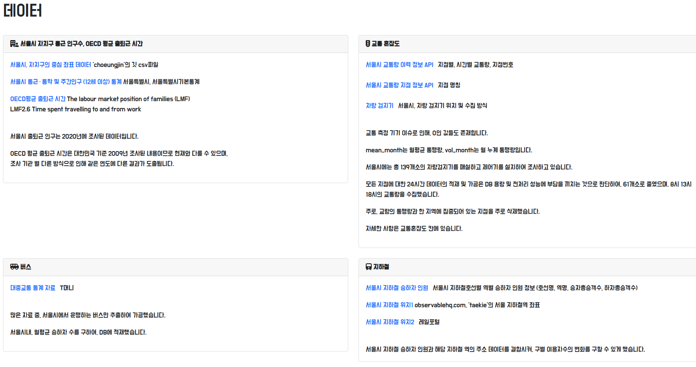
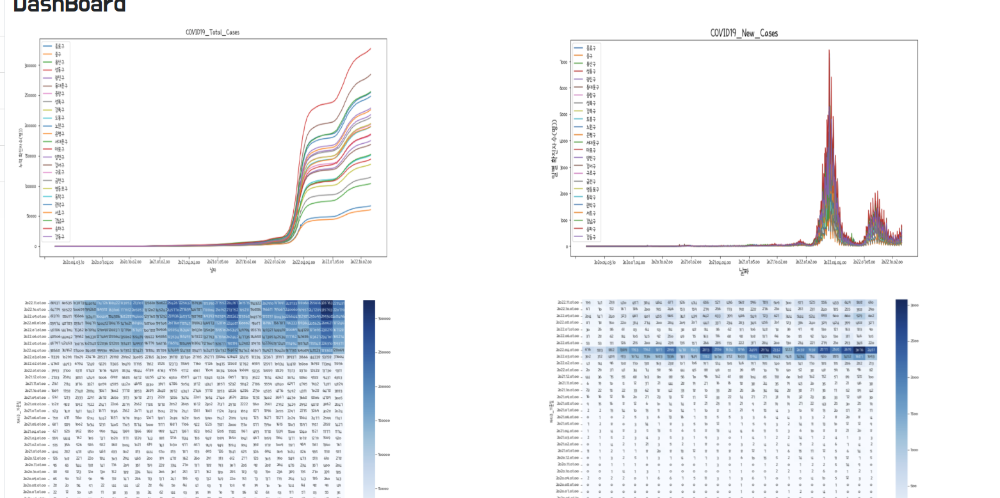
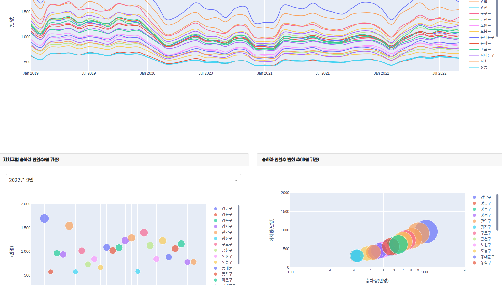
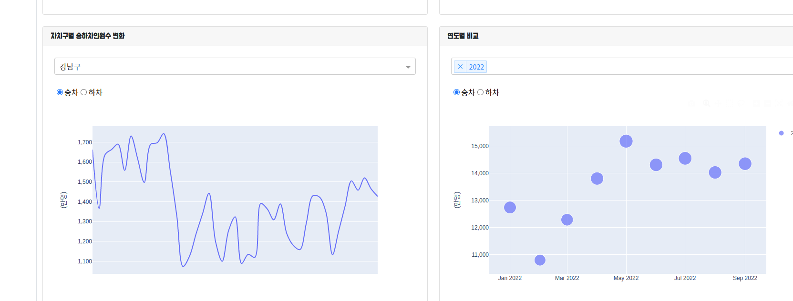
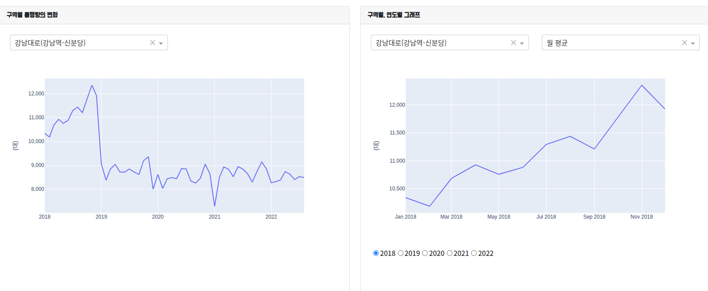

# Team visualization project with Django + PlotlyDash

## Tools and Library
- Django
- plotlyDash

I write README file, because i want to share how to integrate Django with Plotly-Dash.

The hardest part of this project is lack of example.

If you clone this porject, you will see how to write settings.py and register plotly_dash apps.

Because of security, there is no settings.py in github.
so, see right below.

<hr>

## setting.py to use plotlyDash

```python

"""
Django settings for Traffic project.

Generated by 'django-admin startproject' using Django 3.2.16.

For more information on this file, see
https://docs.djangoproject.com/en/3.2/topics/settings/

For the full list of settings and their values, see
https://docs.djangoproject.com/en/3.2/ref/settings/
"""

from pathlib import Path

# Build paths inside the project like this: BASE_DIR / 'subdir'.
BASE_DIR = Path(__file__).resolve().parent.parent


# Quick-start development settings - unsuitable for production
# See https://docs.djangoproject.com/en/3.2/howto/deployment/checklist/

# SECURITY WARNING: keep the secret key used in production secret!


# SECURITY WARNING: don't run with debug turned on in production!
DEBUG = True

ALLOWED_HOSTS = []


# Application definition

INSTALLED_APPS = [
    'django.contrib.admin',
    'django.contrib.auth',
    'django.contrib.contenttypes',
    'django.contrib.sessions',
    'django.contrib.messages',
    'django.contrib.staticfiles',

    #plottlyDash
    'django_plotly_dash.apps.DjangoPlotlyDashConfig',

    'plotting'

]

MIDDLEWARE = [
    'django.middleware.security.SecurityMiddleware',
    'django.contrib.sessions.middleware.SessionMiddleware',
    'django.middleware.common.CommonMiddleware',
    'django.middleware.csrf.CsrfViewMiddleware',
    'django.contrib.auth.middleware.AuthenticationMiddleware',
    'django.contrib.messages.middleware.MessageMiddleware',
    'django.middleware.clickjacking.XFrameOptionsMiddleware',

    #plottlydash
    'django_plotly_dash.middleware.ExternalRedirectionMiddleware',
]

ROOT_URLCONF = 'Traffic.urls'

TEMPLATES = [
    {
        'BACKEND': 'django.template.backends.django.DjangoTemplates',
        'DIRS': [],
        'APP_DIRS': True,
        'OPTIONS': {
            'context_processors': [
                'django.template.context_processors.debug',
                'django.template.context_processors.request',
                'django.contrib.auth.context_processors.auth',
                'django.contrib.messages.context_processors.messages',
            ],
        },
    },
]

WSGI_APPLICATION = 'Traffic.wsgi.application'


# Database
# https://docs.djangoproject.com/en/3.2/ref/settings/#databases

DATABASES = {
    'default': {
        'ENGINE': 'django.db.backends.mysql',

        'PORT':  '3306'
    }
}


# Password validation
# https://docs.djangoproject.com/en/3.2/ref/settings/#auth-password-validators

AUTH_PASSWORD_VALIDATORS = [
    {
        'NAME': 'django.contrib.auth.password_validation.UserAttributeSimilarityValidator',
    },
    {
        'NAME': 'django.contrib.auth.password_validation.MinimumLengthValidator',
    },
    {
        'NAME': 'django.contrib.auth.password_validation.CommonPasswordValidator',
    },
    {
        'NAME': 'django.contrib.auth.password_validation.NumericPasswordValidator',
    },
]


# Internationalization
# https://docs.djangoproject.com/en/3.2/topics/i18n/

LANGUAGE_CODE = 'en-us'

TIME_ZONE = 'UTC'

USE_I18N = True

USE_L10N = True

USE_TZ = True


# Static files (CSS, JavaScript, Images)
# https://docs.djangoproject.com/en/3.2/howto/static-files/

STATIC_URL = '/static/'
STATICFILES_DIRS = [BASE_DIR / 'static']

# Default primary key field type
# https://docs.djangoproject.com/en/3.2/ref/settings/#default-auto-field

DEFAULT_AUTO_FIELD = 'django.db.models.BigAutoField'

X_FRAME_OPTIONS = 'SAMEORIGIN'

```

## urls.py - register plotly dash.apps

```python

from django.urls import path
from . import views

from plotting.dash_apps import app1, app2, app3, TimeToWork, RoadSpecific, RoadOverall, RoadByYear, subway0, subway1, subway2, subway3, RoadTable, bus


urlpatterns = [
    path('', views.index, name = 'index'),

    #Dashboard: 간단하게 표현할때, 사용 가장 간편하고 흥미위주로
    path('dashboard/', views.dashboard, name = 'dashboard'),

    path('seoulIndex/', views.seoulIndex, name = 'seoulIndex'),

    path('roadTraffic/', views.roadTraffic, name='roadTraffic'),

    path('bus/', views.bus, name='bus'),

    path('subway/', views.subway, name='subway'),

    path('CovidPolicy/', views.covidPolicy, name='covidPolicy'),

]
```

<br>

# 시각화 프로젝트 - 코로나 전, 그리고 지금

## 배경
코로나 전과 후의 차량, 지하철, 버스의 흐름을 파악하기 위한 프로젝트를 진행했습니다.

## 사용한 툴
- 장고
- plotlyDash
- mariadb, AWS - EC2

## 데이터 수집 출처 - 홈페이지 캡처



<hr>

## 결과물

### 코로나



<hr>

### 버스



<hr>

### 지하철



<hr>

### 교통



<hr>

## 기대효과
 
 인류사에서는 지속적으로 펜데믹이 왔습니다. 미지의 무언가를 상대를 할 경우, 알고 있는 점은 단지, 과거의 데이터라고 생각합니다.

 지금 현재의 상황을 기록하고 시각화하는 것은 앞으로 다가올 새로운 병에 대한 인류의 준비 과정중 하나일 겁니다.

 또한, 현재의 교통 상황을 기록하여, 다음 팬데믹엔 버스, 지하철과 같은 운송업 종사자들에 대한 빠르고 신속한 지원을 위한 기초자료가 될 수 있습니다.

 운송업은 국가의 모세혈관입니다. 해당 기능이 팬데믹이라고 정상적으로 작동하지 않는다면, 국가의 위기 극복 능력 또한 떨어지게 됩니다. 부디 다음 위기에는 그들의 노고를 가벼히 여기지 않아야 합니다.

제가 직접 발표한 PPT또한 같이 첨부합니다.